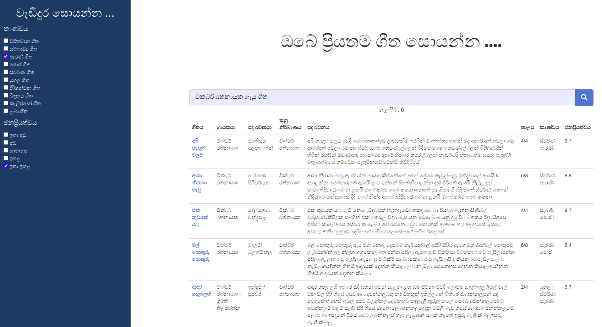
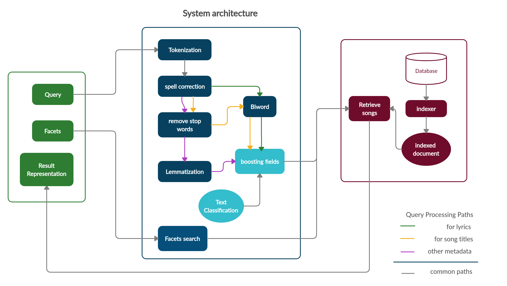
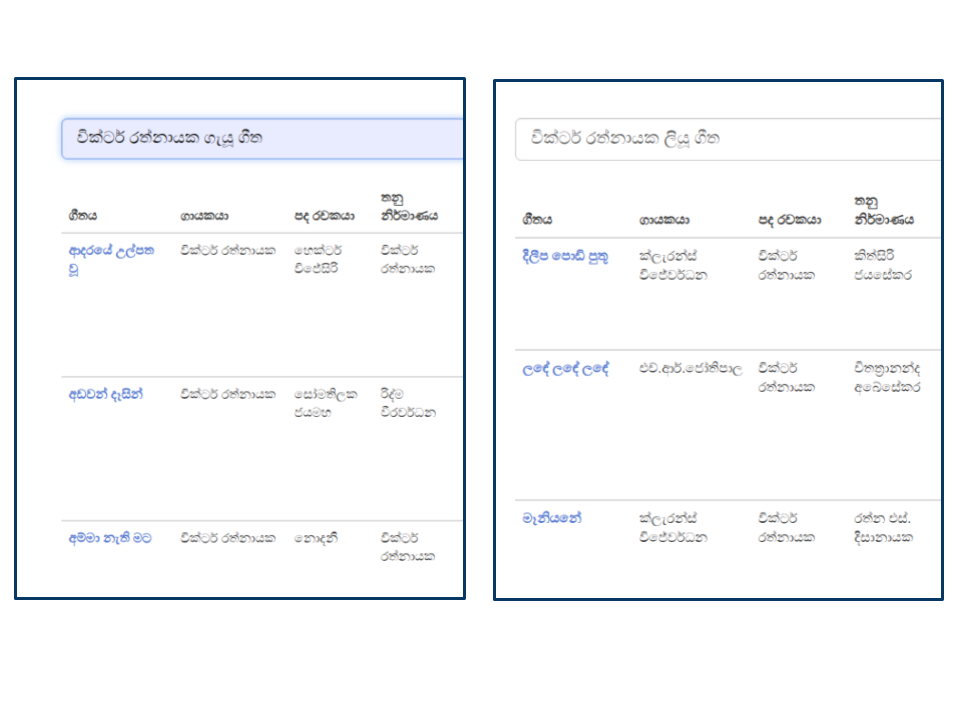
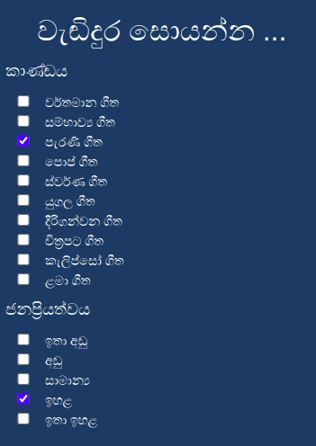

# IR_project-song_search_engine
The songs can be searched by a search engine with 8 metadata. The song title, name of the singer, name of the composer, name of the music producer, lyrics, beat, genre and rating. 
An interface is also available supporting basic functions to enhav]nce the user experience. Search bar, facets in checkbox format, and search results are provided along with the user interface.
The search engine is implemented with the elastic search engine and the python client.

## System Architecture

## Indexing          
I create specific mapping focusing on this scenario. I used positional indexing, as the order of the word occurrence is important especially for the song title and the lyrics.

## Tokenization    
Tokenize the query by all the symbols as any symbol does not give any special meaning in this scenario.

## Spell correction    
check each word in the query is in corpus otherwise suggest a term by calculating the similarity of each word in the corpus with the weighted edit distance method.

## Remove stopwords    
Remove stop word in the query. If any token has occurred in the stopword corpus that token will be ignored at the searching process. However, this query process does not apply when the searching is done under the song title and lyrics fields as those fields must be searched with the stop words. For other fields, all the stop words will be removed.

## Lemmatization        
The lemmatization is applied to the tokens which are remaining after removing the stopwords. the lemmatization is implemented only focusing on the artist's name. Here also this query process does not when the searching is done under the song title and lyrics fields as they need to be searched in the given form of the words.

## Text classification    
when the query is given, the text classification can be used to identify which metadata field the user interested in. I implement the text classification as the one-layer neural network. As the training data are unavailable I manually handcrafted weight and the bias. For that, I identified potential words for each metadata class assume that only those words can be used to specify a particular metadata field. 
The text classification gives the probability of the user query being interested in a particular metadata class.

## Boosting fields    
Using the results of the text classification, the necessary fields will be boosted. The boosting affect the scores of the search result given by the electricsearch.  

## Facets            
The facets are available for advanced filtering searches. The searching can be done with any number of facets nad any combination of facets either along with the main query or only with facets.

## Retrieve documents 
When retrieving the songs, two separated query processing paths are used as shown in the architectural diagram. One is for song titles and lyrics and the other one is for all other fields. 
match_phrase was used in the searching process as the position of the words is important, especially for the song tile and the lyrics.
